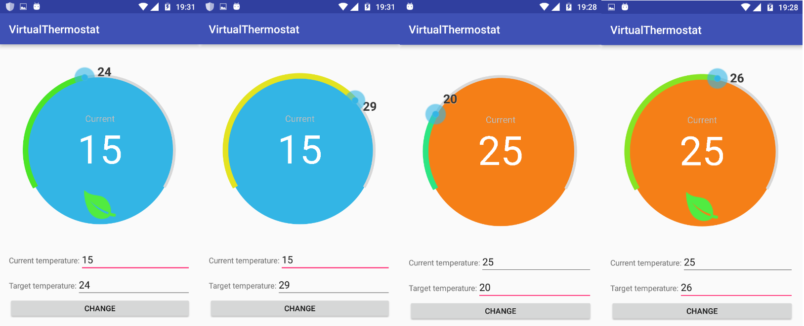

VirtualThermostat
=======

VirtualThermostat is a component I created in my thesis project. It uses [SeekArc](https://github.com/neild001/SeekArc) as a base and adds further functionalities to create a thermostat.

* Shows temperature
* Shows target temperature
* Changes the color of the bar from blue to red when swipping
* Allows the user to specify the minimum and maximum target temperature values
* Shows an icon when the target temperature is in a certain range (like nest thermostat, shows the leaf)
* Change the background color programmatically
* Has all the features of [SeekArc](https://github.com/neild001/SeekArc) V1.1


<div align="center">
  
</div>


## To use it in your code

Simply add the View to your layout (There are several custom attributes) 

      <pt.ulisboa.tecnico.virtualthermostat.VirtualThermostat
                android:id="@+id/virtualThermostat"
                android:layout_width="500dp"
                android:layout_height="350dp"
                virtualthermostat:clockwise="true"
                virtualthermostat:max="35"
                virtualthermostat:min="15"
                virtualthermostat:progressWidth="10dp"
                virtualthermostat:arcWidth="5dp"
                virtualthermostat:rotation="180"
                virtualthermostat:startAngle="60"
                virtualthermostat:sweepAngle="240"
                virtualthermostat:touchInside="false"
                android:paddingLeft="60dp" />

            
## Adding to your project

This library is not yet released in Maven Central, until then you can add as a library module. 


#Recent changes 

## Version 1.0

* init release

# Sample Project

You can see the VirtualThermostat working in the sample application. 


# License

```

The MIT License (MIT)

Copyright (c) 2016
Author João Sampaio 

Permission is hereby granted, free of charge, to any person obtaining a copy of
this software and associated documentation files (the "Software"), to deal in
the Software without restriction, including without limitation the rights to
use, copy, modify, merge, publish, distribute, sublicense, and/or sell copies of
the Software, and to permit persons to whom the Software is furnished to do so,
subject to the following conditions:

The above copyright notice and this permission notice shall be included in all
copies or substantial portions of the Software.

THE SOFTWARE IS PROVIDED "AS IS", WITHOUT WARRANTY OF ANY KIND, EXPRESS OR
IMPLIED, INCLUDING BUT NOT LIMITED TO THE WARRANTIES OF MERCHANTABILITY, FITNESS
FOR A PARTICULAR PURPOSE AND NONINFRINGEMENT. IN NO EVENT SHALL THE AUTHORS OR
COPYRIGHT HOLDERS BE LIABLE FOR ANY CLAIM, DAMAGES OR OTHER LIABILITY, WHETHER
IN AN ACTION OF CONTRACT, TORT OR OTHERWISE, ARISING FROM, OUT OF OR IN
CONNECTION WITH THE SOFTWARE OR THE USE OR OTHER DEALINGS IN THE SOFTWARE.

```
